# Amazon SP-API 接続キー取得マニュアル (プレビュー)

このディレクトリには、ツール「ResearchDeck」の動作に必要な **4つの接続キー** をAmazonセラーアカウントから取得するための画像付きスライドマニュアルが格納されています。

ご友人に渡す際は、 `output` フォルダ内の `slide_01.png` 〜 `slide_14.png` の画像ファイル一式をスライド形式で共有してください。

---

## スライド一覧

### 01. タイトル
> **説明**: このマニュアルは、ツール「ResearchDeck」の動作に必要な **4つの接続キー** をご自身のAmazonセラーアカウントから安全に取得するための手順書です。
>
> 以下の4つを取得し、最後にツールの設定画面に入力します：
> 1. **出品者ID (Seller ID)**
> 2. **LWA Client ID**
> 3. **LWA Client Secret**
> 4. **Refresh Token (リフレッシュトークン)**

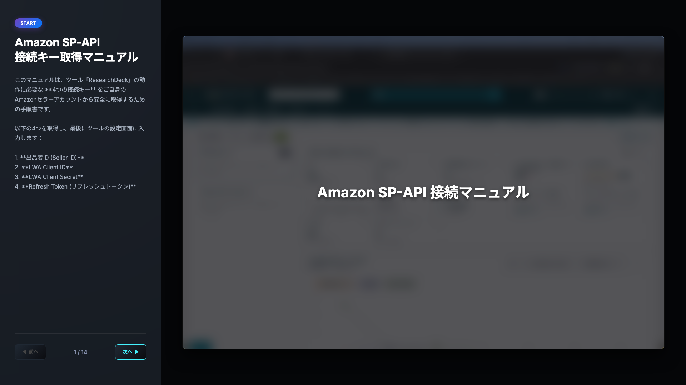

---

### 02. 出品者IDの取得: アカウント情報へ
> **説明**: まずはアカウント固有の「出品者ID」を取得します。セラーセントラルトップ画面の右上にある **「設定（歯車マーク）」** をクリックし、メニューから **「出品用アカウント情報」** を選択します。

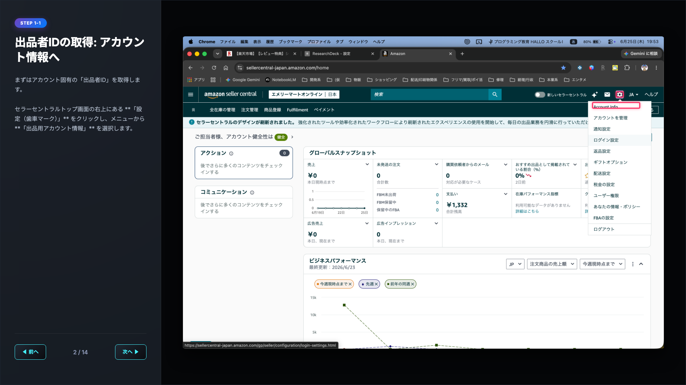

---

### 03. 出品者IDの取得: 出品者情報へ
> **説明**: 出品用アカウント情報画面が開きます。画面左側の「登録内容」セクションにある **「出品者情報」** リンクをクリックします。

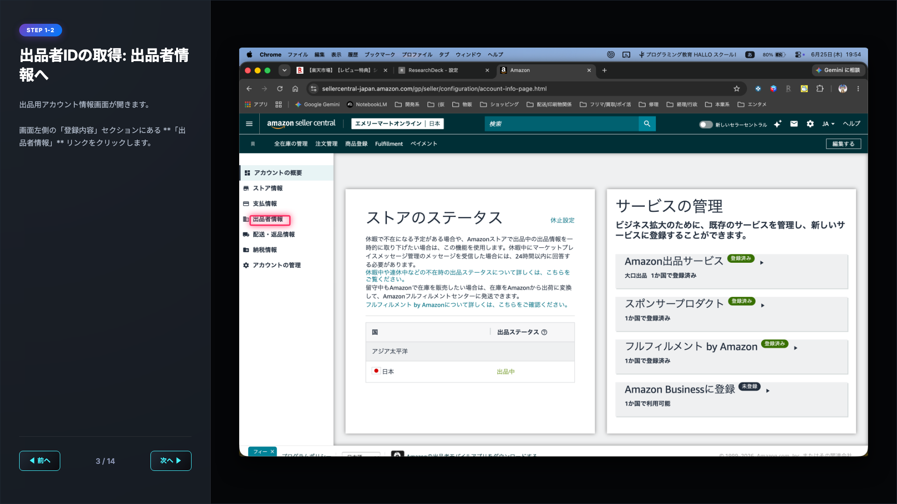

---

### 04. 出品者IDの取得: 出品者トークンへ
> **説明**: 出品者情報画面が開きます。画面中ほどにある **「出品者トークン」** のリンクをクリックします。

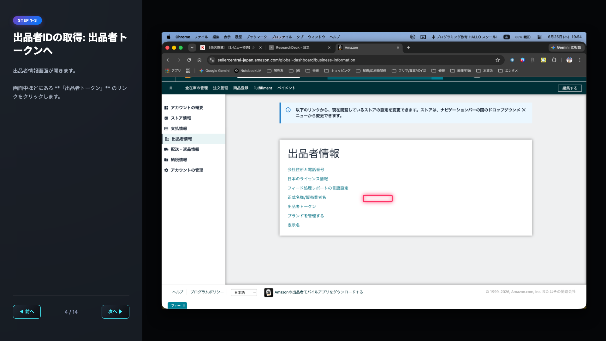

---

### 05. 出品者ID of コピー & 保存
> **説明**: 画面に **「あなたの出品者トークン」** が表示されます。これがツールで設定する **「出品者ID (Seller ID)」** です。`A`から始まる英数字をコピーして保存してください。
>
> 💡 *マニュアル画像では、この個人情報はダミー値にマスクされています。*

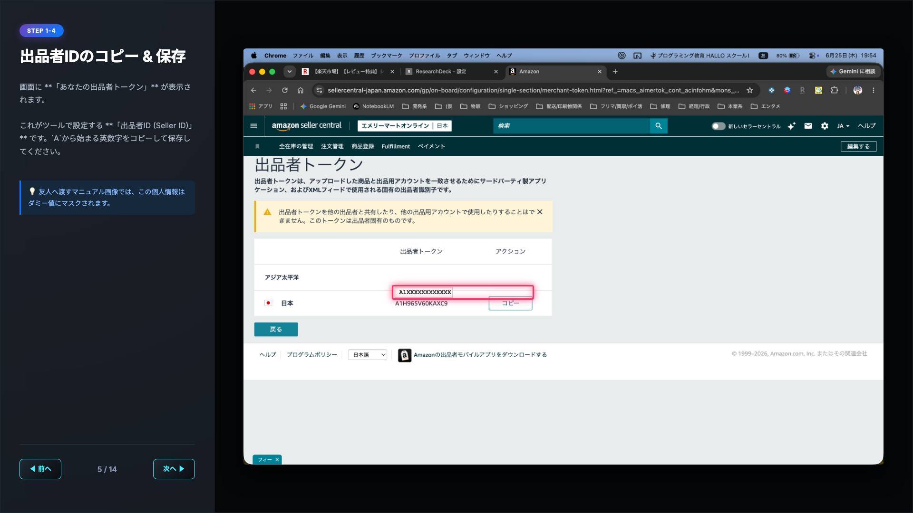

---

### 06. アプリ開発画面を開く
> **説明**: 次に、アプリ登録とLWA Client ID/Secretを取得します。セラーセントラルの左上メニューから **「アプリとサービス」** ➔ **「アプリの開発」** をクリックします。

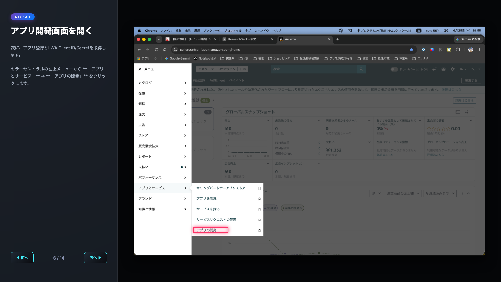

---

### 07. 【補足】初回のみ：ポータル登録とオンボーディング
> **説明**: 「アプリの開発」を初めて開く際、新しいソリューションプロバイダーポータルへの紐付け（オンボーディング）画面が表示されることがあります。画面の指示に従い、アカウントを選択し、Eメールの認証を完了させてください。
>
> 💡 *Eメールなどの機密情報はマスクされています。*

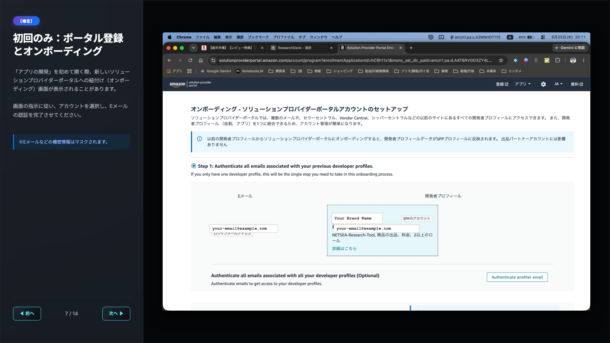

---

### 08. 【補足】オンボーディング：国・アカウント選択
> **説明**: 利用するアカウントと言語・国を選択します。「エメリーマートオンライン（アメリカ合衆国など該当の国）」を選択し、確定します。
>
> 💡 *アカウント名のID部分はマスクされます。*

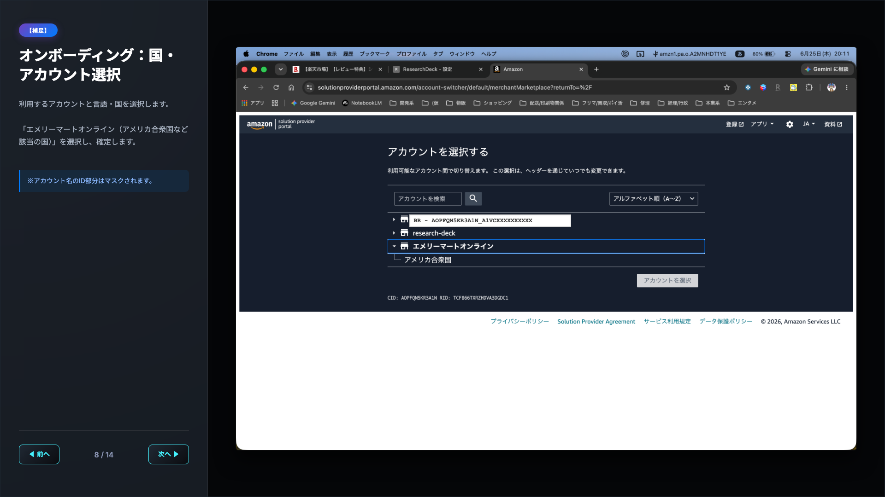

---

### 09. ポータル画面とLWA情報の表示
> **説明**: ソリューションプロバイダーポータルのトップ画面が開きます。登録されているアプリ（例: `NETSEA-Research-Tool`）の「LWA認証情報」列にある **「表示」** リンクをクリックします。
>
> 💡 *アプリIDやアカウント名はマスクされます。*

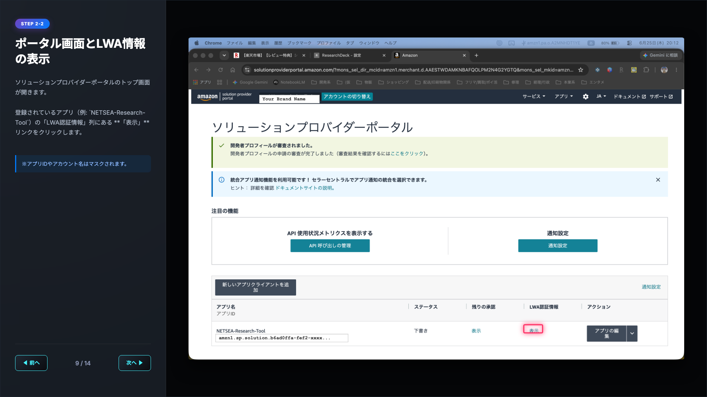

---

### 10. LWA Client ID / Secret の取得
> **説明**: 「LWA認証情報」のポップアップが表示されます。
> 1. **「クライアントID」**（`amzn1.application-oa2-client.〜`）をコピーします。
> 2. **「クライアント機密情報」** アコーディオンを展開し、表示される **「Client Secret」**（`amzn1.oa2-cs.v1.〜`）をコピーします。
>
> ⚠️ *これらは最も重要な暗号鍵です。絶対に他人に教えないでください。*

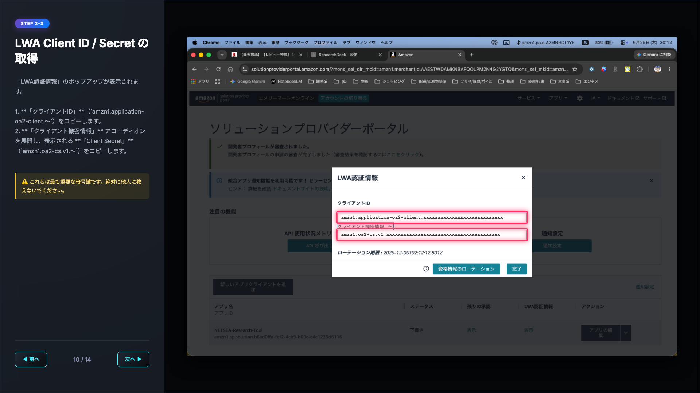

---

### 11. リフレッシュトークン：承認メニューを開く
> **説明**: 続いて、リフレッシュトークン（ツールがデータ通信を継続するための許可証）を取得します。ポータル画面で、アプリの右端にある「アプリの編集」ボタンの右側にある **「∨」矢印** をクリックし、メニューから **「承認」** を選択します。

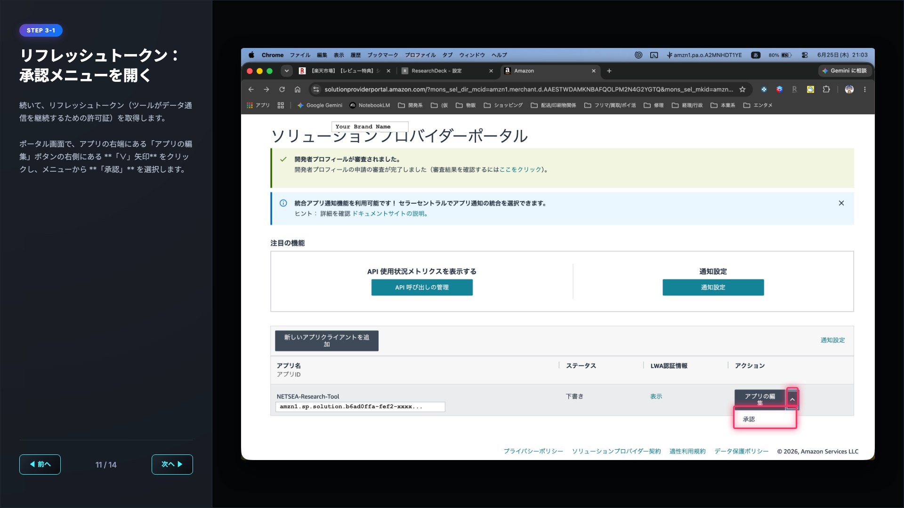

---

### 12. リフレッシュトークン：アプリの認可
> **説明**: 「認可の管理」画面に切り替わります。マーケットプレイス「日本」の右側にある **「アプリを承認」** ボタンをクリックします。

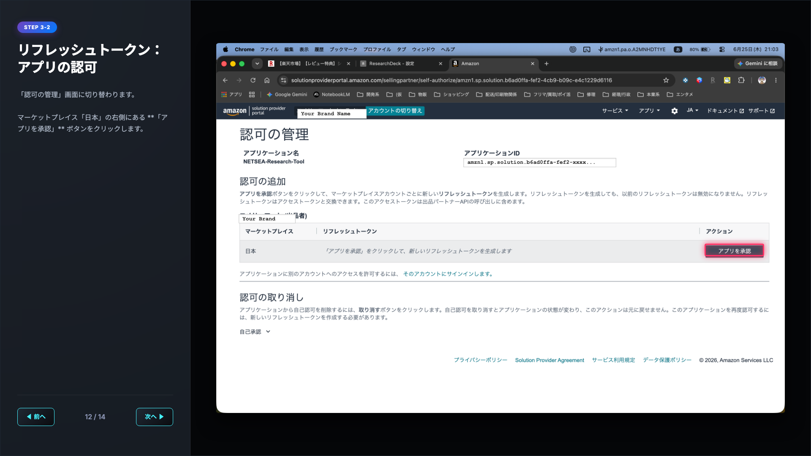

---

### 13. リフレッシュトークンのコピー
> **説明**: 承認が完了すると、画面に **リフレッシュトークン（Refresh Token）** が発行されます。非常に長い英数字の文字列（`Atzr|〜`）が表示されるので、**「コピー」** をクリックして保存します。
>
> ⚠️ *リフレッシュトークンは、この画面を一度閉じると再表示できません。必ずここでコピーしてください！*

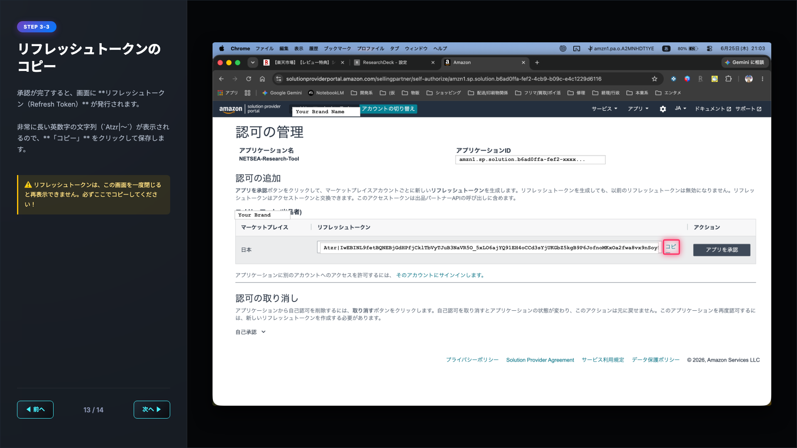

---

### 14. ツール「ResearchDeck」への設定
> **説明**: コピーした4つのキーを、ResearchDeckのオプション設定画面に入力します。
> 1. **LWA Client ID**
> 2. **LWA Client Secret**
> 3. **Refresh Token**
> 4. **Seller ID (出品者ID)**
> 
> を入力し、**「接続テスト」** ボタンを押して「接続成功」となることを確認します。最後に **「保存」** をクリックして完了です！

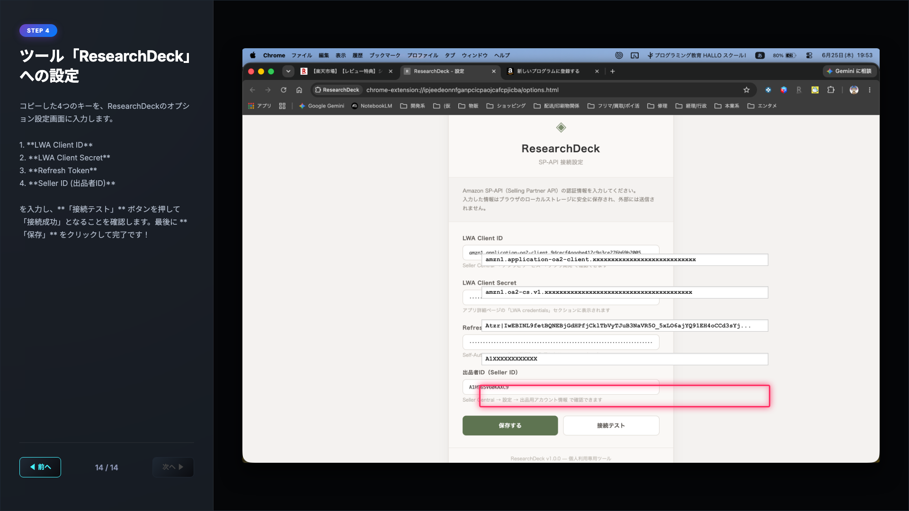
